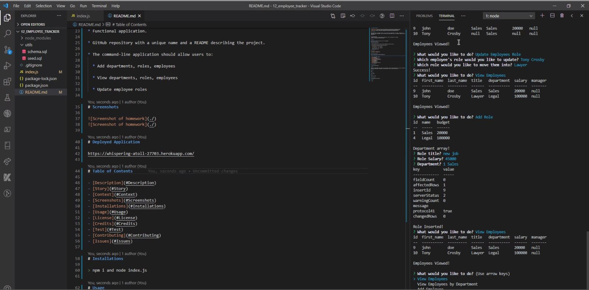
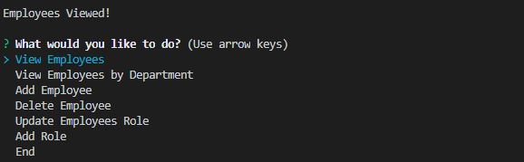

# 12_EMPLOYEE_TRACKER


# Table of Contents

- [Description](#Description)
- [Story](#Story)
- [Context](#Context)
- [Screenshots](#Screenshots)
- [Installations](#Installations)
- [Usage](#Usage)
- [License](#License)
- [Credits](#Credits)
- [Test](#Test)
- [Contributing](#Contributing)
- [Issues](#Issues)

# Description

This application is an employee tracker. You can view the roles, departments, first name, last name, title, department, salary and manager. You can also add roles and departments as well as employees. Employees can have their roles updated.

# Story

```
As a business owner
I want to be able to view and manage the departments, roles, and employees in my company
So that I can organize and plan my business
```

# Context

For business owners that need to keep track of a lot of employees.

## Minimum Requirements

- Functional application.

- GitHub repository with a unique name and a README describing the project.

- The command-line application should allow users to:

  - Add departments, roles, employees

  - View departments, roles, employees

  - Update employee roles

# Screenshots




# Deployed Application

https://drive.google.com/file/d/173iU9j9_skm2hc0AVX3-5Tb7bWJe9uCU/view

# Installations

> npm i and node index.js

# Usage

Running the Node command: node index.js wil then present the user with various options to: -View all employees -View Employees by Department -Add employees -Delete Employees -Add role -Update employee roles

# License

None

# Credits

Tony Crosby

# Test

there is no test

# Contributing

By commiting early and often

# Issues

> none
